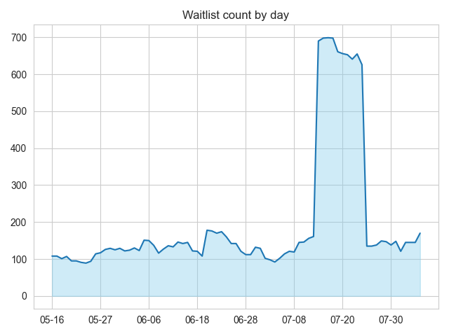

## Scraper for SF Shelter Waitlist

[San Francisco Shelter Waitlist](https://hsh.sfgov.org/services/how-to-get-services/accessing-temporary-shelter/adult-temporary-shelter/shelter-reservation-waitlist/) is a service provided by the city of San Francisco to help homeless people get access to temporary shelters. The waitlist is updated daily and the data is available in a tabular format. This project scrapes the data from the website and stores it in a database.

